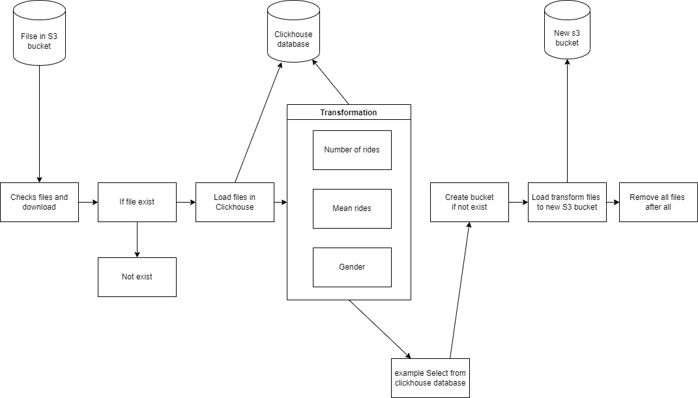
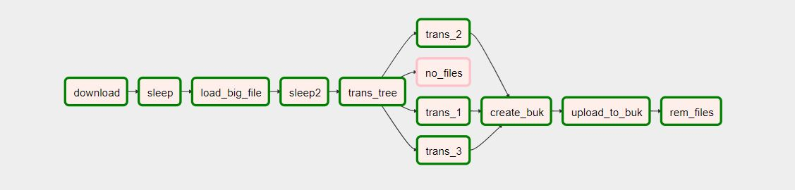

## Пайплайн выгрузки ежедневных отчетов

Вам необходимо построить airflow пайплайн выгрузки ежедневных отчётов по количеству поездок на велосипедах в городе Нью-Йорк.

Отслеживание появление новых файлов в своём бакете на AWS S3.

При появлении нового файла запускается оператор импорта данных в созданную таблицу базы данных Clickhouse.

Необходимо сформировать таблицы с ежедневными отчётами по следующим критериям: 
– количество поездок в день 
– средняя продолжительность поездок в день 
– распределение поездок пользователей, разбитых по категории «gender»

Данные статистики необходимо загрузить на специальный S3 бакет с хранящимися отчётами по загруженным файлам.
--------------------------------------------------------------------------------------------------------------

За основу взят docker-compose puckel/docker-airflow. 

Сборка docker-compose:
Postgres - база Postgres для хранения метаданных
webserver - графический интерфейс (порт 8080)
flower - это веб-инструмент для мониторинга и администрирования кластеров Celery
scheduler - планировщик
worker - кластер на котором происходят все процессы
ch_server - сервер Clickhouse

Команда для сборки:

    docker-compose -f docker-compose-CeleryExecutor.yml up -d

### Схема:

По порту 8123 в DBeaver был подключен Clickhouse и были созданы таблицы:

    CREATE DATABASE RIDES

### Буфер для выгрузки из оперативной памяти

    CREATE TABLE RIDES.hits_buffer (
    tripduration String, 
    starttime String, 
    stoptime String, 
    start_station_id String, 
    start_station_name String, 
    start_station_latitude String, 
    start_station_longitude String, 
    end_station_id String, 
    end_station_name String, 
    end_station_latitude String, 
    end_station_longitude String, 
    bikeid String, 
    usertype String, 
    birth_YEAR String, 
    gender String ) 
    ENGINE = Buffer(RIDES, rides_to_new_york, 16, 1, 5, 100, 1000, 100000, 10000000)

### Основная таблица

    CREATE OR REPLACE TABLE RIDES.rides_to_new_york ( 
    tripduration String, 
    starttime String, 
    stoptime String, 
    start_station_id String, 
    start_station_name String, 
    start_station_latitude String, 
    start_station_longitude String, 
    end_station_id String, 
    end_station_name String, 
    end_station_latitude String, 
    end_station_longitude String, 
    bikeid String, 
    usertype String, 
    birth_YEAR String, 
    gender String ) 
    ENGINE = MergeTree ORDER BY tripduration;

### Количество поездок в день

    CREATE OR REPLACE TABLE RIDES.number_rides (
    date Date, 
    number_rides UInt32 ) 
    ENGINE = ReplacingMergeTree ORDER BY date;

### Среднее количество поездок в день

    CREATE OR REPLACE TABLE RIDES.mean_ride (
    date Date, 
    mean String ) 
    ENGINE = ReplacingMergeTree ORDER BY date;

### Распределение поедок по столбцу gender

    CREATE OR REPLACE TABLE RIDES.gender (
    date Date, 
    gender UInt8, 
    numbers UInt32) 
    ENGINE = ReplacingMergeTree ORDER BY date;

## Результат

Вывод дага:

Таблица с данными:

Загруженные файлы на s3:

## Краткое описание отчетов в папке example:

    example_select.csv:

Количество поездок в зависимости от года рождения за первые 5 дней месяца.

1 колонка - год рождения; 2 колонка - дата; 3 колонка - количество поездок в этот день.

    transform_gender_values_new_file.csv:

Распределение поездок пользователей, разбитых по категории «gender».

1 колонка - дата; 2 колонка - пол; 3 колонка - количество поездок.

    transform_mean_ride_per_day_new_file.csv:

Средняя продолжительность поездок в день.

1 колонка - дата; 2 колонка - среднее время поездки за этот день.

    transform_num_of_rides_per_day_new_file.csv:

Количество поездок в день.

1 колонка - дата; 2 колонка - общее количество поездок за этот день.